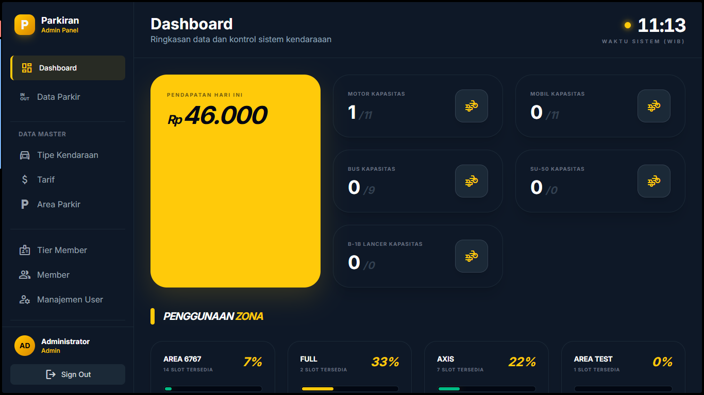
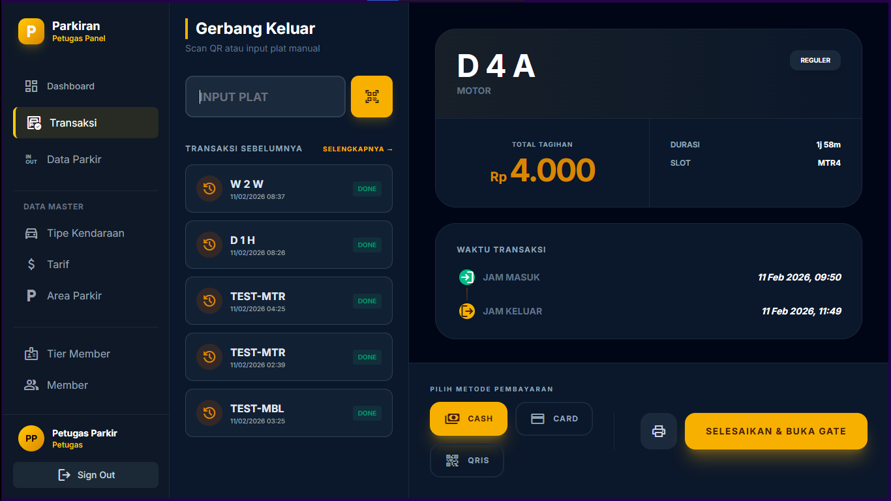
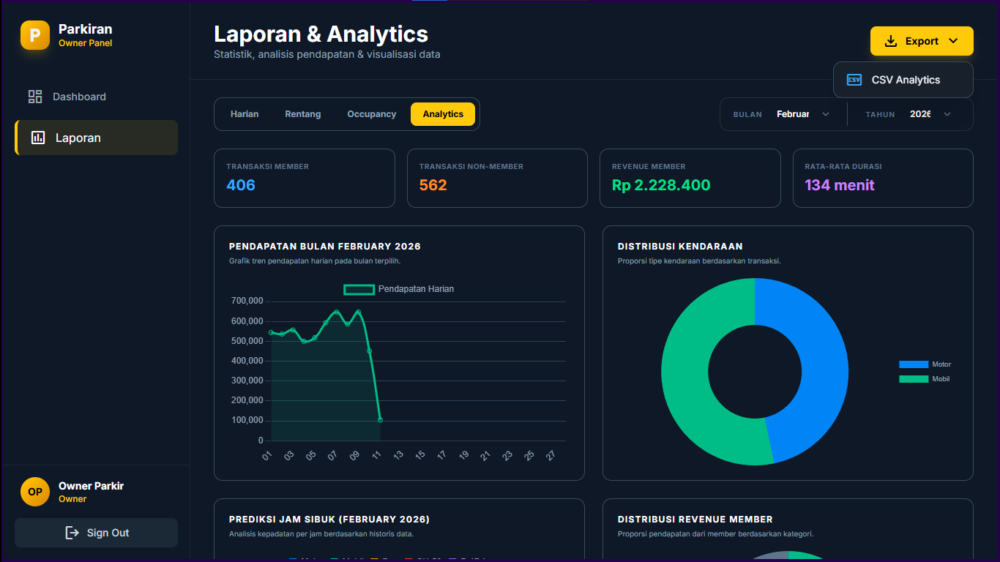
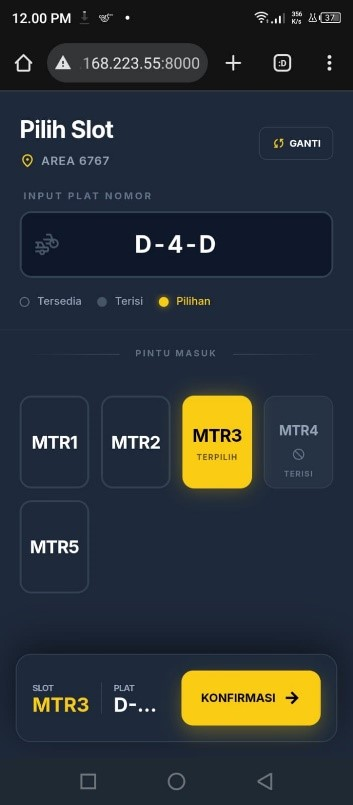
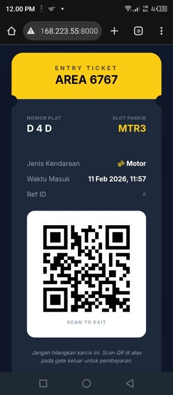

# 🚗 Parkiran App - Sistem Manajemen Parkir Modern

Sebuah solusi manajemen parkir yang efisien dan modern, dibangun menggunakan **Laravel 10** dan **Livewire 3**.  
Aplikasi ini dirancang untuk menyederhanakan operasional parkir, mulai dari pencatatan masuk/keluar kendaraan, pengelolaan slot, hingga pelaporan keuangan yang akurat.

---


# 🖥️ Tampilan Website

Berikut adalah beberapa tampilan utama dari aplikasi **Parkiran App**:

## 📊 Dashboard
Menampilkan ringkasan data parkir, grafik pendapatan, dan statistik kendaraan secara real-time.



---

## 🚗 Transaksi Parkir (Check-in / Check-out)
Halaman operasional untuk mencatat kendaraan masuk dan keluar dengan sistem QR Code.



---

## 📈 Laporan & Analitik
Menampilkan laporan pendapatan harian, bulanan, serta fitur export ke PDF & Excel.



---

## 📱 Pilih Slot dan Karcis Digital (Mobile)
Menampilkan pemilihan slot dan karcis digital.

<table align="center">
<tr>
<td align="center">

<br/>
<b>Pilih Slot</b>
</td>

<td align="center">

<br/>
<b>Karcis Digital</b>
</td>
</tr>
</table>

---


## 🚀 Fitur Utama

### 🚗 Manajemen Operasional
- Check-in & Check-out Cepat
- QR Code Integration untuk tiket parkir
- Real-time Slot Monitoring
- Dukungan berbagai kategori kendaraan (Motor, Mobil, dll)

### 👥 Hak Akses & Keamanan (Role-Based Access Control)
- **Admin** → Akses penuh sistem
- **Petugas** → Operasional transaksi parkir
- **Owner** → Monitoring laporan & statistik

### 📊 Laporan & Analitik
- Dashboard Interaktif
- Grafik pendapatan harian/bulanan
- Laporan keuangan detail
- Export PDF & Excel

### 🛠️ Fitur Tambahan
- Backup Database
- Cetak Struk Parkir
- QR Code Generator

---

## 💻 Teknologi yang Digunakan

- Laravel 10
- Livewire 3
- Tailwind CSS
- MySQL
- Vite

### Library Pendukung
- barryvdh/laravel-dompdf (Export PDF)
- maatwebsite/excel (Export Excel)
- endroid/qr-code (QR Generator)
- spatie/laravel-backup (Backup System)

---

## 📋 Prasyarat Sistem

Pastikan sistem Anda memiliki:

- PHP ^8.1
- Composer
- Node.js & NPM
- MySQL Database

---

## ⚙️ Cara Instalasi

### 1️⃣ Clone Repository

```bash
git clone https://github.com/SoraYaki04/parkiran-app.git
cd parkiran-app
```

### 2️⃣ Install Dependencies

```bash
composer install
npm install
```

### 3️⃣ Konfigurasi Environment

```bash
cp .env.example .env
```

Edit file `.env` dan sesuaikan:

```env
DB_DATABASE=nama_database
DB_USERNAME=root
DB_PASSWORD=
```

---

### 4️⃣ Generate Key

```bash
php artisan key:generate
```

---

### 5️⃣ Setup Database

```bash
php artisan migrate --seed
```

---

### 6️⃣ Setup Storage

```bash
php artisan storage:link
```

---

### 7️⃣ Build Assets

```bash
npm run build
```

---

### 8️⃣ Jalankan Server

```bash
php artisan serve
```

Akses di browser:

```
http://localhost:8000
```

---

## 🔐 Akun Demo (Seeder)

Jika menggunakan seeder:

| Role     | Username | Password     |
|----------|----------|--------------|
| Admin    | admin    | admin123     |
| Petugas  | petugas  | petugas123   |
| Owner    | owner    | owner123     |

---

# 📱 Akses Aplikasi dari HP (Satu WiFi)

Jika ingin testing menggunakan HP dalam jaringan WiFi yang sama:

---

## 1️⃣ Ganti IP di `.env`

```env
APP_URL=http://192.168.1.10:8000
```

> Ganti IP sesuai IP lokal komputer Anda  
> Cek dengan:
> - Windows → `ipconfig`
> - Mac/Linux → `ifconfig`

---

## 2️⃣ Edit `vite.config.js`

```js
import { defineConfig } from 'vite'
import laravel from 'laravel-vite-plugin'

export default defineConfig({
    plugins: [
        laravel({
            input: ['resources/css/app.css', 'resources/js/app.js'],
            refresh: true,
        }),
    ],
    server: {
        host: '0.0.0.0',
        port: 5173,
        hmr: {
            host: '192.168.1.10',
        },
    },
})
```

---

## 3️⃣ Jalankan Server dengan Host Terbuka

```bash
php artisan serve --host=0.0.0.0 --port=8000
npm run dev
php artisan schedule:work
```

---

## 4️⃣ Akses dari HP

Buka browser HP dan akses:

```
http://192.168.1.10:8000
```

---

### ⚠️ Pastikan

- HP dan komputer berada di WiFi yang sama
- Firewall tidak memblokir port 8000 dan 5173

---

## 📄 Lisensi

Project ini menggunakan MIT License.
